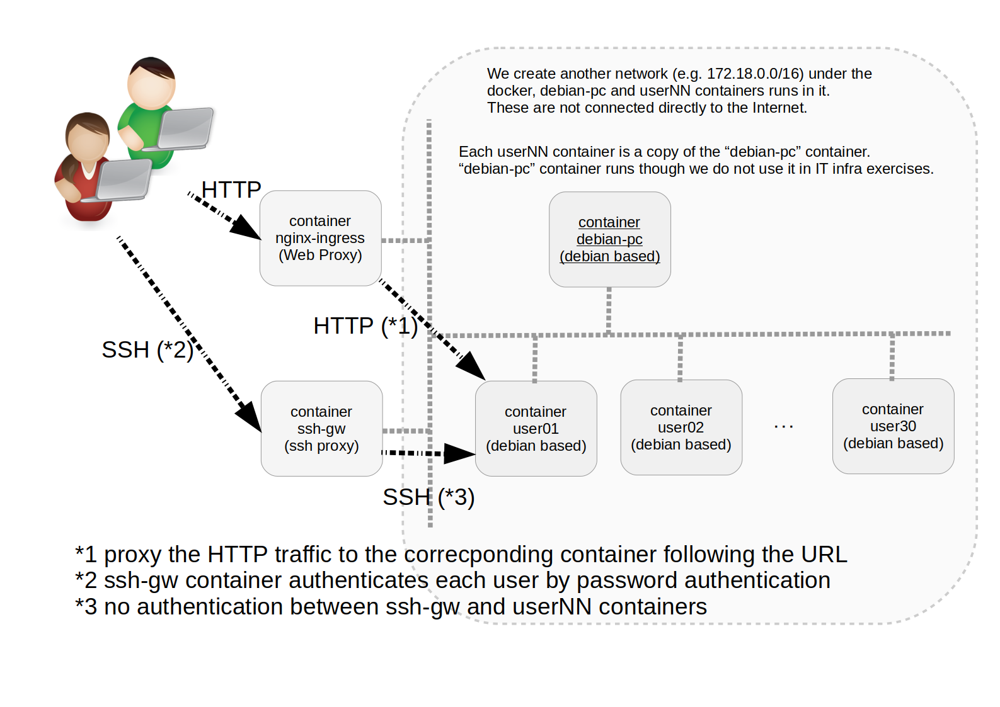

# a docker-based Hands-On environment suitable for basic IT infrastructure build training

This is a docker-compose repository to build a hands-on environment,
which was prepared for an LPI Webinar held on 2024-06-08.

See the document for more details in 
[[English (英語)]](docs/README.en.md)
or
[[Japanese (日本語)]](docs/README.ja.md).

You can see the Webinar Archive at =>

