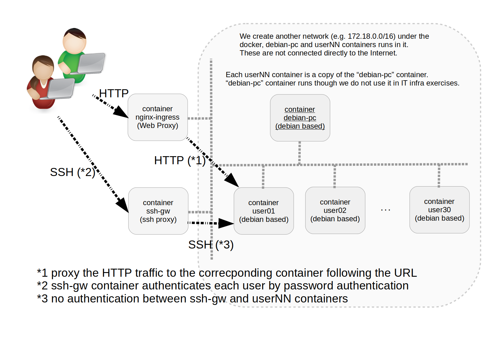

# Hands-On explained

[[Japanese (日本語)]](README.ja.md).


## Overview

- This system can provide exercise environments for IT infrastructure build training.
- try to be functional as could as possible
- You can build the same environment as many times as you need.
  You can discard it soon when the environment becomes dirty. 
- docker-compose based.


### Hands-on Operation

- Please let each participant know
  (a) user-name e.g. user01
  (b) password
  (c) the server name to SSH login
  and
  (d) the URL to http access.
  For example, for the participant no. 1:
  
| key		| value							|
|:---|:---|
| user-name	| user01						|
| password	| 16 chars randomized string e.g. ZnL5uG2yZvq2cLEH	|
| server name   | www.user01.demo.fml.org				|
| URL		| http://www.user01.demo.fml.org/			|

- You can customize the domain.
- This system automatically generate a set of the user-name and password at the first time.


### Features

- Debian (Debian GNU/Linux 12.x, amd64) based.
- Each user can SSH-login each container which provides least tools required for the hands-on.
- This system prepares one container for one participan.
  The container name is user01, user02 ...
    - these exercise containers e.g. user01 are not directly open to the Internet.
    - each user needs to access the container via ssh and web proxy containers.
- support only 22/tcp and 80/tcp.  
- Under this, you can find the following container repositories for this system.
    - debian-pc
    - nginx-ingress
    - ssh-gw
    - testweb
- logging on the host, running docker, via syslog.
  You can monitor each user command input per line in each `userNN` container in realtime.

```
[Example: tail -F /var/log/syslog]

Aug  4 11:17:51 ec2 user01/hands-on-base-user01-1/dd3edd35b475[19598]:  user01      admin 2024-08-04T02:17:51 1722737871 --- curl -O https://lpic-2024q2.demo.fml.org/dist/www.py [0]
Aug  4 11:17:57 ec2 user01/hands-on-base-user01-1/dd3edd35b475[19598]:  user01      admin 2024-08-04T02:17:57 1722737877 --- sudo python3 www.py [0]
Aug  4 11:18:28 ec2 user01/hands-on-base-user01-1/dd3edd35b475[19598]:  user01      admin 2024-08-04T02:18:28 1722737908 --- exit [130]
```




## How to verify

- [check if you can SSH-login to containers](TEST.en.md)


## First appearance

- prepared for the LPI Webinar held on 2024-06-08).
- You can see this archive video at the YouTube (click the thumbnail image below)
   - You can see the slide in Japanese only [(v1.0.0)](https://speakerdeck.com/fmlorg/burauzanohutawokai-ketehttpti-yan-siyou-20240608v1-dot-0-0)

[](https://www.youtube.com/watch?v=y84Asag9O1o)


## License

Creative Commons BY-NC-SA [4.0](https://creativecommons.org/licenses/by/4.0/deed.en).

<HR>
Last-Modified: 2024-08-03
Copyright (C) 2024 Ken'ichi Fukamachi, CC BY-NC-SA 4.0
