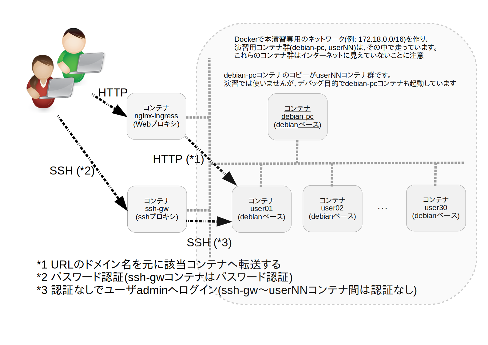

# ハンズオン環境について

[[English (英語)]](README.en.md).


## 概要

- ITインフラの演習環境を提供することが目的です
- せっかく準備するので、できるだけ汎用性のある演習基盤となるように考えました
- docker環境なので、何度でも同じ環境を作れます。また、演習で環境が汚れても、すぐに捨てられます
- これらの設定はdocker-composeで書かれています


### 想定している運用形態

- ハンズオンの受講者(以下ユーザ)には、それぞれのユーザ名、パスワード、SSHするドメイン名、利用するURLを伝えます。
  たとえば、受講者1番へ伝える情報は次のものです
  
| キー		| 値							|
|:---|:---|
| ユーザ名	| user01						|
| パスワード	| ZnL5uG2yZvq2cLEHのような16文字のランダム文字列	|
| サーバ名      | www.user01.demo.fml.org				|
| URL		| http://www.user01.demo.fml.org/			|

- 注意
   - ドメイン名(以下の例ではdemo.fml.org部分)はカスタマイズできます
   - ユーザ名とパスワードは自動生成されます

### 特徴

- debianベース (Debian GNU/Linux 12.xベース, アーキテクチャはamd64)
- 各ユーザは、演習で必要な最低限のツールだけをインストールしたコンテナへログインできます
- 各ユーザごとのコンテナを用意しています。コンテナ名は user01 user02 ... のように連番です
    - これらのコンテナ群は、インターネットから見えていません
    - ssh proxyとweb proxyのコンテナを経由して、これらの演習環境にアクセスします
- 演習で利用可能なプロトコルは22/tcpと80/tcpだけです
- このシステムで利用する計4コンテナ群のリポジトリは下表のとおりです。
- ホスト(dockerを実行している環境)側のsyslogには、コンテナ(userNN)上でユーザが実行したコマンド履歴が1行ずつリアルタイムに記録されていきます。
  ホスト側で`tail -F /var/log/syslog`などとすれば、受講者の様子をモニタすることができます。
  運営側でモニタしながら、たとえば、「user03さん、コマンド間違ってますよ〜」などとレコメンドできるでしょう

| コンテナ	| 内容											|
|:---|:---|
| debian-pc	| Debianベースの演習環境,テスト環境							|
| 		| debain-pcのコピーがuserNNコンテナ;カスタマイズする対象				|
| 		| 裏ネットワーク上に存在し、proxy越しにインターネットと通信する(直接の通信はない)	|
| nginx-ingress	| nginxベースのweb proxy								|
| 		| インターネットに対しHTTP(80/tcp)を開いている						|
| ssh-gw	| opensshベースのssh proxy								|
| 		| インターネットに対しSSH(22/tcp)を開いている						|
| testweb	| テスト環境										|

```
[例: tail -F /var/log/syslog]

Aug  4 11:17:51 ec2 user01/hands-on-base-user01-1/dd3edd35b475[19598]:  user01      admin 2024-08-04T02:17:51 1722737871 --- curl -O https://lpic-2024q2.demo.fml.org/dist/www.py [0]
Aug  4 11:17:57 ec2 user01/hands-on-base-user01-1/dd3edd35b475[19598]:  user01      admin 2024-08-04T02:17:57 1722737877 --- sudo python3 www.py [0]
Aug  4 11:18:28 ec2 user01/hands-on-base-user01-1/dd3edd35b475[19598]:  user01      admin 2024-08-04T02:18:28 1722737908 --- exit [130]
```



- 日本語版だけですが、詳細な解説(PDF,技術同人誌?)が準備中です


## 動作確認

- [ログインできるかを確認する](TEST.ja.md)


## 初出

- 本ハンズオン環境は、
LPI Webinar "ブラウザのフタを開けてHTTP体験しよう" (2024/06/08)の演習環境として用意されたdocker環境です。
- 本Webinarのアーカイブ動画はYoutubeで御覧になれます(以下のサムネイル画像をクリック)
   - [](https://www.youtube.com/watch?v=y84Asag9O1o)
- 動画の元スライドは[こちら (v1.0.0)](https://speakerdeck.com/fmlorg/burauzanohutawokai-ketehttpti-yan-siyou-20240608v1-dot-0-0)


## ライセンス

Creative Commons BY-NC-SA [4.0](https://creativecommons.org/licenses/by/4.0/deed.ja) に沿って御利用ください

- 以下のような利用は(著作権者に断りなく)自由に御利用ください
  -  個人での勉学
  -  無料もしくは実費(テキスト印刷代や部屋代など)のみの勉強会
  -  社内研修等の組織内勉強会での利用
    (厳密には、社内研修=長期的な意味で営利目的なのかもしれませんが、かまいません)
- 商用利用については御相談ください。例:
  -  営利目的のセミナー等で利用する
  -  営利目的での販売


<HR>
Last-Modified: 2024-08-03
Copyright (C) 2024 Ken'ichi Fukamachi, CC BY-NC-SA 4.0
